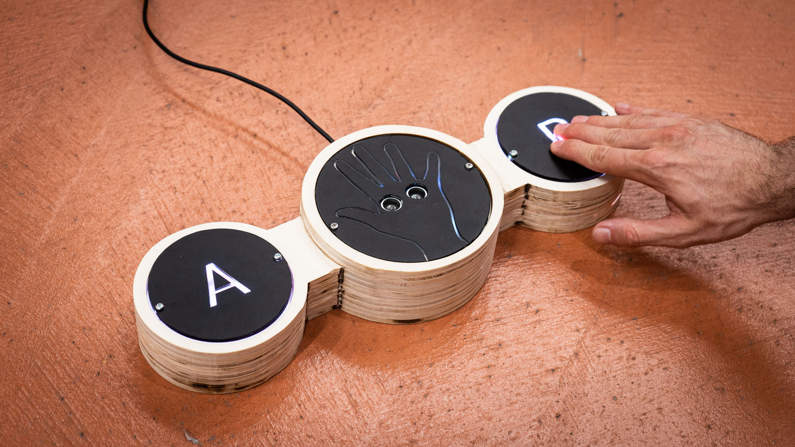
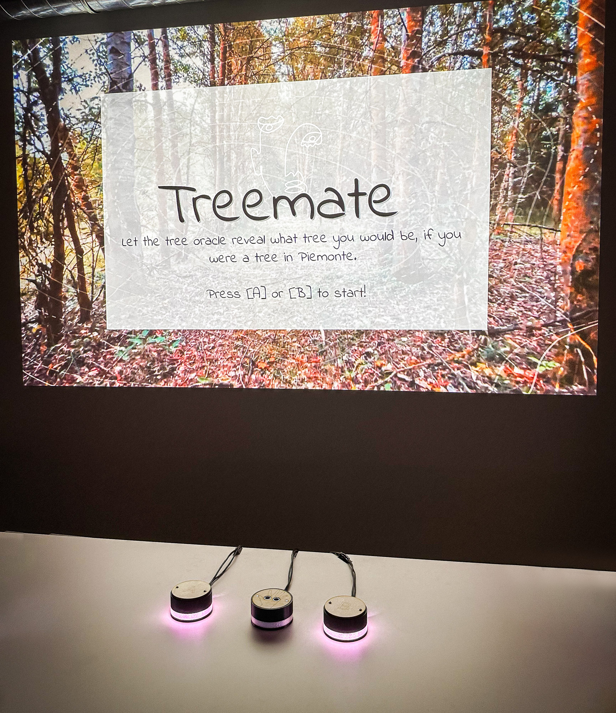
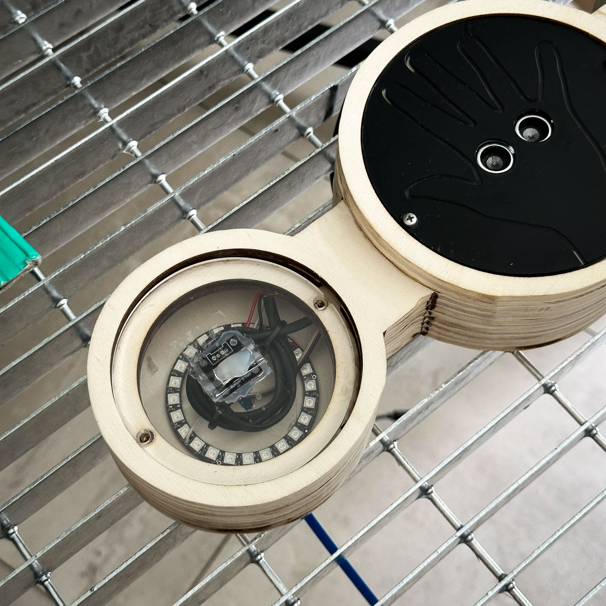
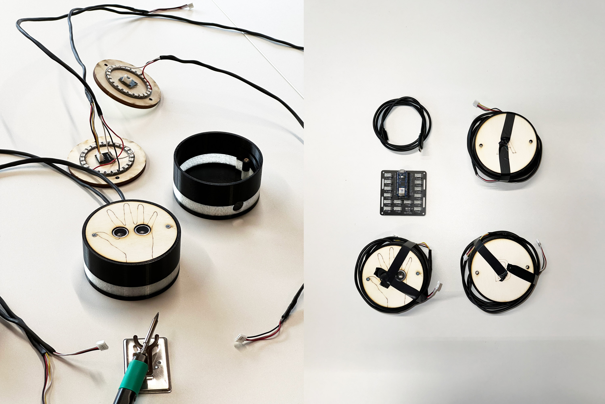
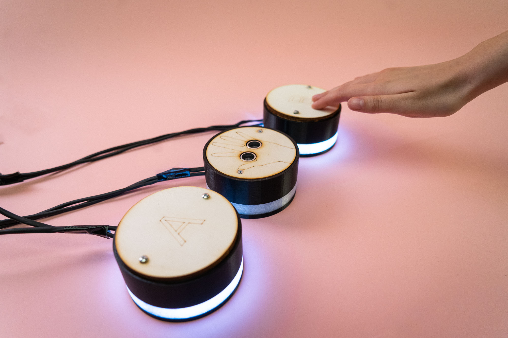
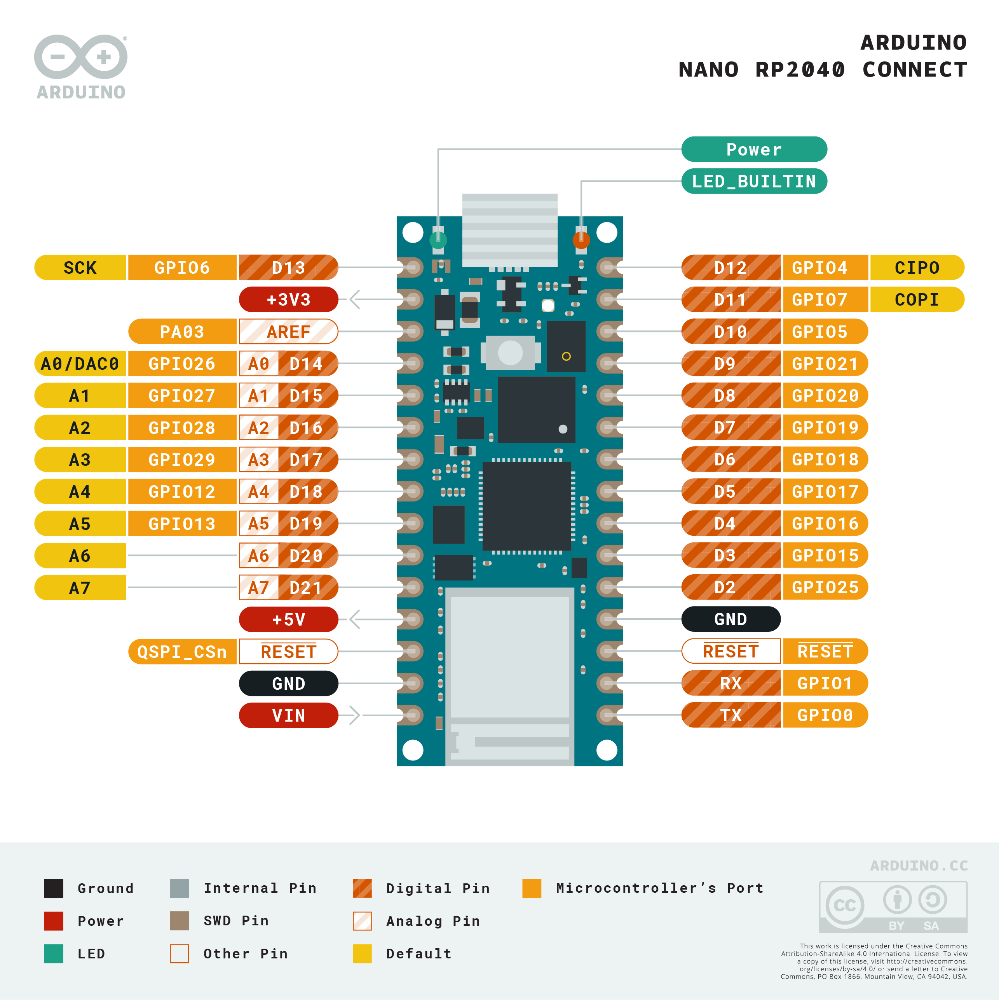
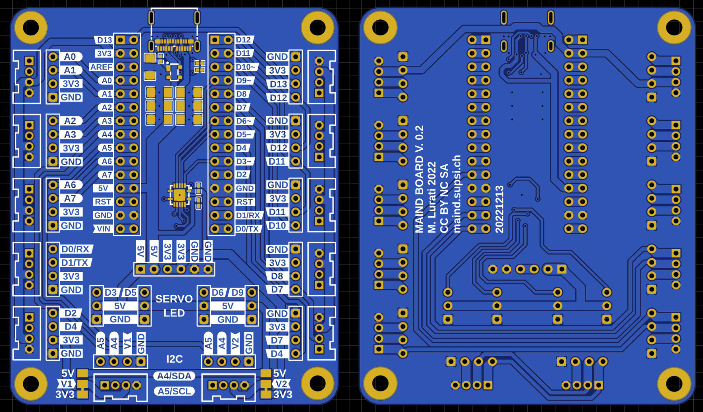

# Treemate

Treemate offers a captivating journey of connecting users with a tree from Piemonte based on their personality. An interactive quiz takes the user through randomly selected questions from a question pool and reveals their tree match based on their individual choices. The interaction happens with two action buttons and one scanner: the buttons have lights to tell the user what buttons are active besides the instructions on the screen. Users can redo the quiz as often as they want and keep discovering other trees from Piemonte.

Treemate was one of the projects exhibited at [Circolo's del Design](https://www.circolodeldesign.it/)'s Earthrise23.

This project was built by Angela Landi, Irene Njoku, [Marcello Zanetta](https://www.marcellozanetta.com/) and me during a course led by [Fabio Franchino](https://www.fabiofranchino.com/).

Arduino files are located in the folder `interface` and the frontend part (P5.js) in the folder `frontend`.

## Product Overview

Initially, instructions about the Treemate quiz are shown on the screen. During the quiz, users must select A or B to answer an abstract personality question. The results of the user's answers will match them to a specific personality, and their personality will be then matched with a tree from Piemonte. At the end of the quiz, the user will be able to learn more about themselves and feel connected to a tree. All results have a beautiful message to take away. The installation involves a tree oracle, subtle background music, and sounds to make the user experience more immersive. Users can repeat the quiz repeatedly, where they will be confronted with different questions. Users will discover the trees from the region and have a great time, whether doing the quiz alone or with friends.

## Treemate's Physical Interface

Treemate's physical interface has two push buttons (A and B) and a hand scanner. The installation can be installed on any screen - we used a beamer for our prototype and later moved to a TV for the exhibition. The two push buttons are used for the main navigation, answering the personality quiz shown on the screen and returning to our program's first state. The scanner is used in the final part of the quiz to let the user feel connected to the tree oracle. The buttons give proper feedback when pressed, and lights & sound will also show that an action has taken place. The physical interface consists of various layers of plywood and covers in transparent & engraved plexiglas covered with vinyl. When the scan is being performed, the lights will pulse a little faster to show that the scan is taking place. The interface resets the state of the installation whenever it's connected to the computer serving the front- and backend.

### Components

For this project we used an Arduino Nano RP2040, 2 push buttons, three NeoPixel Rings with each 24 LEDs, a seeed grove ultrasonic ranger, and a carrier designed by [Marco Lurati](https://marcolurati.ch/). Below are some images of our prototype and the inside of the final version of Treemate.

