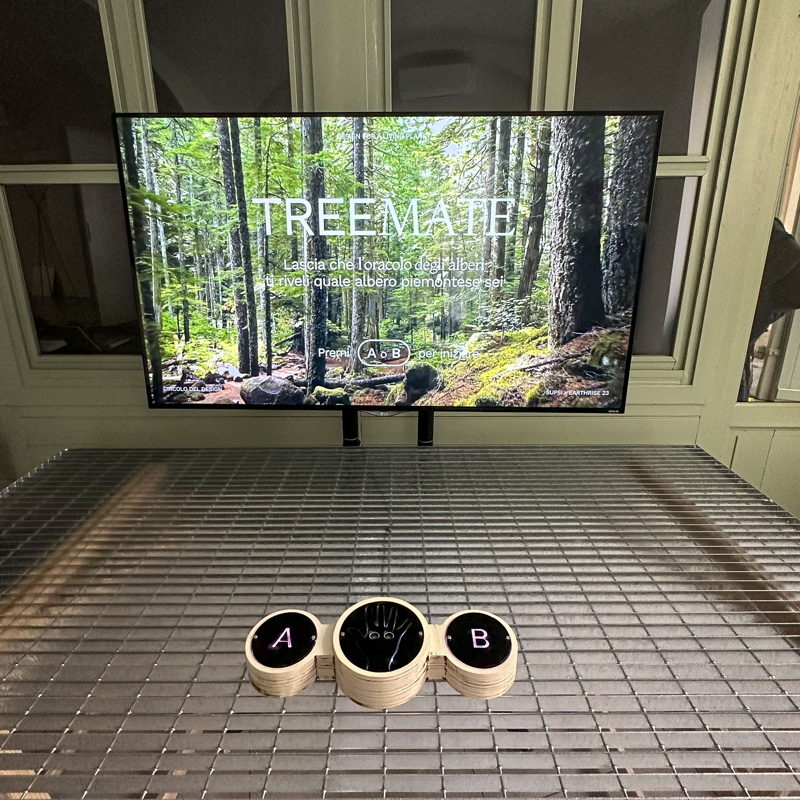

# Treemate

Treemate offers a captivating journey of connecting users with a tree from Piemonte based on their personality. An interactive quiz will take the user through randomly selected questions and reveal their tree match based on their choices. The tree match lets them discover details of one specific tree from the region. The interaction will happen with two action buttons and one scanner: the buttons will have lights to tell the user what buttons are active besides the instructions on the screen. Users can select to redo the quiz as often as they want and keep discovering other trees from Piemonte.

This project was built by Angela Landi, Irene Njoku and me during a course led by [Fabio Franchino](https://www.fabiofranchino.com/).

Arduino files are located in the folder `interface` and the frontend part (P5.js) in the folder `frontend`.

## Product Overview

Initially, instructions about the Treemate quiz are shown on the screen. During the quiz, users must select A or B to answer an abstract question. The results of the user's answers will match them to a specific personality, and their personality will be then matched with a tree from Piemonte. At the end of the quiz, the user will be able to learn more from that tree and how the tree matches their personality - e.g., a sweet person might be associated with a fruit-producing tree. All results have a beautiful message to take away and also include a QR code to share their tree match on Twitter quickly. The installation also involves a tree oracle (an animated avatar), subtle background music, and sounds to make the user experience more immersive. Users can repeat the quiz repeatedly, where they will be confronted with different questions. Users will discover the trees from the region and have a great time, whether doing the quiz alone or with friends.

The goal of Treemate was to design an interactive installation for Earthrise23 that would let users discover information about trees located in Piemonte with an entertaining twist. For future iterations, we recommend adding more refined questions and results based on further research on personality matchmaking. We suggest exploring different areas with the same concept (quiz -> personality -> information), as our audience was generally thrilled with the experience and their results.

## Treemate's Physical Interface

Treemate's physical interface has two push buttons (A and B) and a hand scanner. The installation can be installed on any screen - we used a beamer for our prototype. The two push buttons are used for the main navigation, answering the personality quiz shown on the screen and returning to our program's first state. The scanner is used in the final part of the quiz to let the user feel connected to the tree oracle. The buttons give proper feedback when pressed, and lights & sound will also show that an action has taken place. To let light through the physical elements, we 3D printed a part in semisolid / transparent filament. When the scan is being performed, the lights will pulse a little faster to show that the scan is taking place.

## Arduino (RP2040) & Carrier Layout

For this project we used an Arduino RP2040 and a carrier designed by [Marco Lurati](https://marcolurati.ch/).

